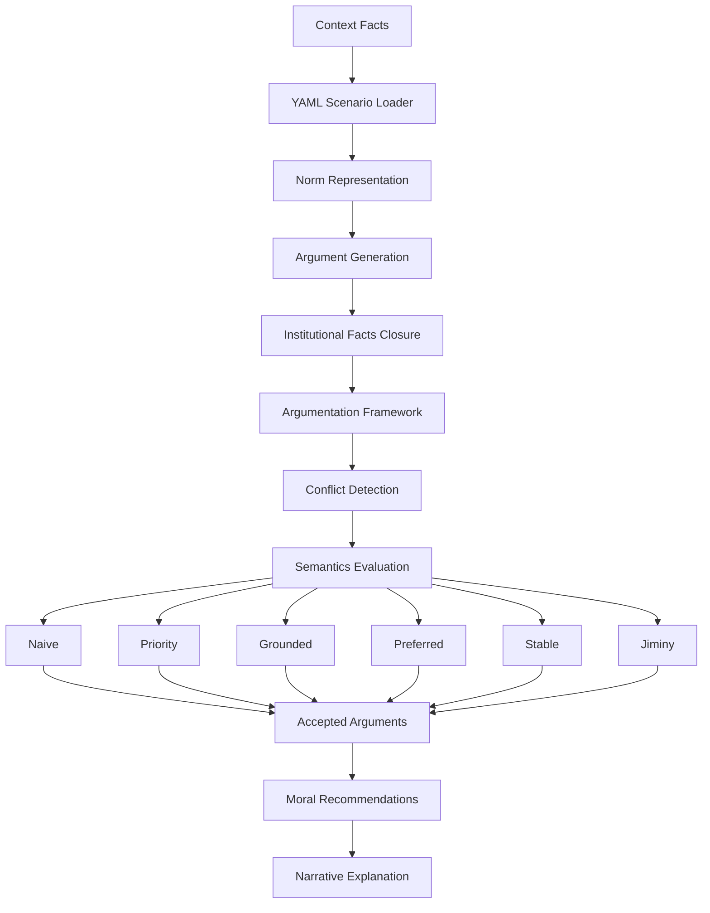

# Jiminy Engine

Jiminy Engine is a Python implementation of a **normative reasoning and argumentation framework for multi-stakeholder decision making**.


[](https://mybinder.org/v2/gh/jiminy-framework/jiminy/HEAD)


The engine operationalizes the model proposed in:

> **The Jiminy Advisor: Moral Agreements among Stakeholders Based on Norms and Argumentation**  
> B. Liao, P. Pardo, M. Slavkovik, L. van der Torre  
> Journal of Artificial Intelligence Research (JAIR), 2023.

Jiminy enables autonomous systems to reason about ethical decisions by combining:

- normative systems
- formal argumentation
- stakeholder preferences
- context-dependent reasoning

The framework generates explainable decisions by constructing argumentation structures from norms and evaluating them under different semantics.

---

# Features

Jiminy Engine provides:

- normative reasoning based on **constitutive, regulative and permissive norms**
- modelling of **multiple stakeholders**
- argument generation from contextual facts
- conflict detection using **contrariness relations**
- evaluation under several semantics:
  - naive
  - grounded
  - preferred
  - stable
  - priority-based
  - jiminy semantics
- explainable reasoning traces
- YAML scenario descriptions
- optional Graphviz visualization

---

# Repository Structure

```
.
├── jiminy                # Core engine
│   ├── engine.py
│   ├── arguments.py
│   ├── norms.py
│   ├── yaml_loader.py
│   └── visualization
│
├── cli                   # Command-line interface
│   └── jiminy_cli.py
│
├── scenarios             # Example normative scenarios
│
├── tests                 # Unit tests
│
├── notebooks             # Demonstrations
│
├── experiments           # Research experiments
│
├── scripts               # Utility scripts
│
└── docs                  # Documentation
```

---

# Installation

Clone the repository:

```bash
git clone https://github.com/jiminy-framework/jiminy.git
cd jiminy
```

Install dependencies using a virtual environment (recommended):

```bash
python3 -m venv venv
source venv/bin/activate
pip install -r requirements.txt
```

Alternatively, install dependencies manually:

```bash
pip install pyyaml graphviz pytest matplotlib
```

---

# Quick Start

Run the engine on an example scenario:

```bash
python -m cli.jiminy_cli scenarios/agrobot.yaml
```

Example with explicit context facts:

```bash
python -m cli.jiminy_cli \
--semantics jiminy \
scenarios/candy_unified.yaml \
--facts w1 w3 w4 w5
```

Example output:

```
i_before accepted
d1 accepted
```

This indicates that the institutional fact `i_before` and the decision `d1`
are accepted under the selected semantics.

---

# Using the Engine from Python

Jiminy can also be used as a Python library.

```python
from jiminy.engine import Jiminy
from jiminy.yaml_loader import load_scenario

(
    possible_context,
    norms,
    contrariness,
    priorities,
    context_desc,
    norm_desc,
    contrariness_desc,
    priority_desc
) = load_scenario("scenarios/agrobot.yaml")

jim = Jiminy(
    norms,
    contrariness,
    priorities,
    context_desc,
    norm_desc,
    contrariness_desc,
    priority_desc
)

args = jim.generate_arguments(possible_context)

accepted, rejected = jim.compute_extension(args, semantics="jiminy")

print(jim.explain(accepted, rejected, possible_context))
```

---

# Scenario Format

Scenarios are defined using YAML.

Example:

```yaml
context:

  - id: w1
    description: child present

norms:

  - id: c1
    body: [w1]
    conclusion: i1
    type: c
    stakeholder: Law
    description: child presence detected
```

Norm types:

| Type | Meaning |
|-----|------|
| `c` | Constitutive norm |
| `r` | Regulative norm |
| `p` | Permission |

---

# Visualization

Jiminy supports optional visualization using Graphviz.

These graphs illustrate:

- reasoning dependencies
- argument conflicts
- accepted vs rejected decisions

Visualization tools are located in:

```
jiminy/visualization
```

---
---

# Architecture

Jiminy implements a normative argumentation pipeline that transforms contextual facts and normative rules into explainable moral recommendations.

The system follows a structured reasoning pipeline:

```
Context Facts
      │
      ▼
YAML Scenario Loader
      │
      ▼
Norm Representation
(body → head, τ, stakeholder)
      │
      ▼
Argument Generation
(normative detachment + closure)
      │
      ▼
Argumentation Framework (AF)
(arguments + attack relations)
      │
      ▼
Semantics Evaluation
(naive / priority / grounded / preferred / stable / jiminy)
      │
      ▼
Accepted Arguments
      │
      ▼
Moral Recommendations
(deontic actions)
      │
      ▼
Narrative Explanation
```

---

## System Architecture

The Jiminy reasoning pipeline transforms contextual facts and normative rules into explainable moral recommendations.



---

### Reasoning Pipeline

The system performs the following reasoning steps:

1. **Context loading**  
   Contextual facts are loaded from the YAML scenario.

2. **Norm parsing**  
   Normative rules are converted into internal representations.

3. **Argument generation**  
   The engine derives arguments through normative detachment.

4. **Institutional closure**  
   Constitutive rules generate institutional facts until closure.

5. **Argumentation framework construction**  
   Arguments and attack relations form an abstract argumentation framework.

6. **Semantics evaluation**  
   Different argumentation semantics determine which arguments survive.

7. **Decision extraction**  
   Accepted deontic arguments become moral recommendations.

8. **Explanation generation**  
   The system produces a narrative explanation of the reasoning process.


---

# Core Components

The repository is organized around several core modules.

## YAML Scenario Loader

File:

```
jiminy/yaml_loader.py
```

Responsible for parsing YAML scenario descriptions and transforming them into internal structures.

It loads:

- contextual facts
- normative rules
- contrariness relations
- priority values
- textual descriptions

The loader produces the internal structures used by the reasoning engine.

---

## Norm Representation

File:

```
jiminy/norms.py
```

Norms are represented as rules of the form:

```
(φ1, φ2, ..., φn) ⇒^τ_s ψ
```

where:

- **body** = premises (context or institutional facts)
- **head** = derived fact or action
- **τ** ∈ {c, r, p}
- **s** = stakeholder

Norm types:

| Symbol | Meaning |
|------|------|
| `c` | constitutive rule |
| `r` | obligation |
| `p` | permission |

---

## Argument Generation

File:

```
jiminy/engine.py
```

The engine generates arguments by applying normative rules to the context.

Steps:

1. Apply **constitutive rules** to derive institutional facts.
2. Compute **closure** until no new facts are produced.
3. Generate **deontic arguments** (obligations and permissions).

Each argument contains:

- premises
- conclusion
- stakeholder
- rule identifier

---

## Argumentation Framework Construction

After argument generation, the engine constructs an **abstract argumentation framework** consisting of:

```
AF = (Arguments, Attacks)
```

Attacks are derived from **contrariness relations** defined in the YAML scenario.

Example:

```
d_close_gate ↔ d_do_not_act
```

This means the arguments supporting these actions attack each other.

---

## Semantics Evaluation

The engine supports several reasoning semantics.

| Semantics | Description |
|--------|--------|
| naive | maximal conflict-free set |
| priority | resolves conflicts using priority ordering |
| grounded | skeptical minimal extension |
| preferred | maximal admissible extension |
| stable | attacks all rejected arguments |
| jiminy | two-phase normative detachment |

These semantics determine which arguments are accepted or rejected.

---

## Moral Recommendation

The final decision corresponds to the **accepted deontic arguments**.

Example output:

```
Proposed actions: d1, d4, d5
```

Each action corresponds to a normative recommendation derived from the accepted arguments.

---

## Explanation Generation

The system produces human-readable explanations describing:

- contextual facts
- triggered norms
- conflicts between actions
- priority resolution
- final recommendation

This enables **explainable moral reasoning for autonomous systems**.

---

# Repository Structure

```
jiminy/
│
├── cli/                 command-line interface
├── jiminy/
│   ├── engine.py        reasoning engine
│   ├── norms.py         normative rule representation
│   ├── yaml_loader.py   scenario parser
│   └── visualization/   argumentation graph visualizers
│
├── scenarios/           example normative scenarios
├── tests/               automated test suite
├── notebooks/           experimental notebooks
└── docs/                documentation
```

---

# Design Goals

Jiminy is designed with the following goals:

- explainable normative reasoning
- modular argumentation engine
- scenario-based experimentation
- compatibility with standard argumentation semantics
- reproducibility through YAML scenarios

---
---

# Running Tests

The project includes a comprehensive test suite validating the behaviour of the argumentation engine, the YAML loader, and the different reasoning semantics.

Run the full test suite (ensure your virtual environment is activated):

```bash
source venv/bin/activate  # if not already active
python3 -m pytest
```

For verbose execution including debug logs and printed explanations:

```bash
python3 -m pytest -s --log-cli-level=DEBUG
```

To run a specific test file:

```bash
python3 -m pytest -s tests/test_semantic_table.py
```

---

# Test Coverage

The test suite validates the full reasoning pipeline of the Jiminy argumentation engine.

---

## Scenario loading

Verifies that YAML scenarios are correctly parsed and converted into internal data structures.

Examples:

- `tests/test_loader.py`
- `tests/test_agrobot_yaml.py`

Checks include:

- context facts
- norm parsing
- contrariness relations
- priority values
- description fields

---

## Argument generation

Ensures that the engine correctly derives arguments from context facts and normative rules.

Examples:

- `tests/test_generate_arguments.py`
- `tests/test_engine_arguments.py`

Checks include:

- closure of constitutive rules
- generation of institutional facts
- generation of deontic actions

---

## Conflict detection

Verifies that contrary actions correctly attack each other inside the argumentation framework.

Example:

- `tests/test_conflicts.py`

This ensures that the engine correctly constructs the attack relations between arguments.

---

## Scenario-level reasoning

Validates complete reasoning scenarios defined in YAML files.

Example:

- `tests/test_multiple_facts_scenario.py`

The candy scenario verifies:

- behaviour before lunch
- behaviour after lunch
- activation of household rules
- activation of soft monitoring mode
- legal permissions

---

## Semantics evaluation

Tests the different argumentation semantics implemented in the engine.

Example:

- `tests/test_semantics.py`

Covered semantics include:

- priority semantics
- naive semantics
- grounded semantics
- preferred semantics
- stable semantics

---

## Priority handling

Ensures that priority-based defeat behaves correctly.

Example:

- `tests/test_priority_semantics.py`

---

## Naive semantics behaviour

Validates that naive semantics ignores priorities and performs greedy conflict resolution.

Example:

- `tests/test_naive_semantics.py`

---

## Explanation generation

Checks that the explanation module produces correct narrative outputs.

Example:

- `tests/test_explain.py`

For instance, priority information must **not appear in explanations when using naive semantics**.

---

## Semantic comparison table

The repository also includes a test that prints a comparison table of the recommendations produced by different semantics across all scenarios.

Run:

```bash
python3 -m pytest -s tests/test_semantic_table.py
```

Example output:

```
SEMANTIC COMPARISON TABLE
--------------------------------------------------------------------------------
Scenario             Naive                Priority             Jiminy
--------------------------------------------------------------------------------
agrobot.yaml         ...
candy_unified.yaml   ...
jiminy.yaml          ...
smoke_alarm.yaml     ...
--------------------------------------------------------------------------------
```

This test helps inspect how the reasoning results change depending on the selected semantics.


---

# Example Scenarios

Example normative systems are provided in:

```
scenarios/
```

including:

- `agrobot.yaml`
- `candy_unified.yaml`
- `smoke_alarm.yaml`

These scenarios demonstrate how Jiminy can model ethical reasoning problems.

---


# Example Executions

### Example 1 — Export the argumentation framework

This command runs Jiminy using the built-in `jiminy` semantics and exports the generated argumentation framework as a Graphviz graph.

```bash
python -m cli.jiminy_cli --semantics jiminy scenarios/jiminy.yaml --export-graphviz jiminy_af
```

---

### Example 2 — Candy scenario (before lunch)

```bash
python -m cli.jiminy_cli \
--semantics jiminy \
scenarios/candy_unified.yaml \
--facts w1 w3 w4 w5
```

Example reasoning outcome:

```
i_before accepted
d1 accepted
```

This corresponds to the situation **before lunch**, where the system activates the institutional fact `i_before` and recommends decision `d1`.

---

### Example 3 — Candy scenario (after lunch)

```bash
python -m cli.jiminy_cli \
--semantics jiminy \
scenarios/candy_unified.yaml \
--facts w1 w2 w4 w5
```

This scenario activates a different reasoning path and produces a different recommendation according to the normative system.

---

## Running the TUI Option

To run the Textual User Interface (TUI) for Jiminy, use the following command:

```bash
python3 -m tui.run_tui <scenario_file>
```

Replace `<scenario_file>` with the path to your desired scenario file. For example:

```bash
python3 -m tui.run_tui scenarios/candy_unified.yaml
```

You will be able to activate or deactive the w_1 using the keyboard.

---

# Citation

If you use Jiminy Engine in academic work, please cite:

```
Liao, B., Pardo, P., Slavkovik, M., & van der Torre, L. (2023).
The Jiminy Advisor: Moral Agreements among Stakeholders Based on Norms and Argumentation.
Journal of Artificial Intelligence Research.
```

A citation file is also provided:

```
CITATION.cff
```

---

# License

MIT License

---

# Maintainer

Francisco J. Rodríguez-Lera  
University of León