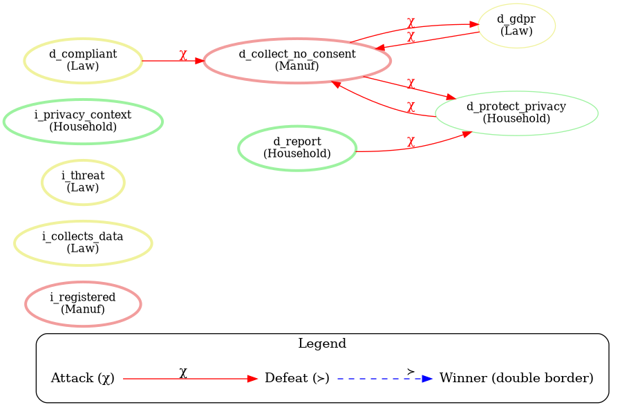
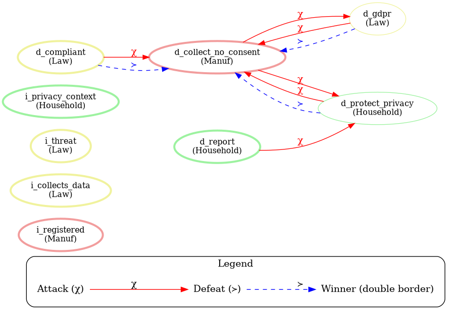

# Jiminy Engine — Classical JAIR Semantics and Scenario Model

Working document to present the normative reasoning implemented in the
**Jiminy Engine** repository and, in particular, the **classical JAIR** approach
based on `base_priorities` and `meta_priorities`.

---

## 1. What is Jiminy Engine?

Jiminy Engine is a Python implementation of the *Jiminy Advisor*, a framework for
**normative reasoning and argumentation for multi-stakeholder decision making**.
It combines:

- **normative systems** (constitutive, regulative and permissive norms),
- **formal argumentation** (arguments and attack relations),
- **stakeholder preferences** (authority and priorities),
- **context-dependent reasoning**.

Base reference:

> Liao, B., Pardo, P., Slavkovik, M., & van der Torre, L. (2023).
> *The Jiminy Advisor: Moral Agreements among Stakeholders Based on Norms and Argumentation.*
> Journal of Artificial Intelligence Research (JAIR).

---

## 2. The model of a scenario

A scenario is described in a YAML file and contains the following blocks.

### 2.1 `context` — brute facts (K)

Observable facts of the environment, with an identifier and a description. They
are activated at runtime according to sensor readings.

```yaml
context:
  - id: w1
    description: "The robot detects an obstacle closer than 30 cm."
  - id: w4
    description: "The robot is in motion."
```

### 2.2 `norms` — normative rules

Each norm is a rule of the form `(φ1,...,φn) ⇒^τ_s ψ`, where:

- `body` — premises (facts or institutional facts),
- `conclusion` — conclusion ψ,
- `type` (`τ`) — norm type,
- `stakeholder` (`s`) — issuing stakeholder/agent,
- `id` — unique identifier.

| Type | Symbol | Effect |
|------|--------|--------|
| Constitutive | `c` | introduces an **institutional fact** `i_*` |
| Regulative | `r` | generates an **obligation** `d_*` |
| Permissive | `p` | generates a **permission** `p_*` |

```yaml
norms:
  - id: S1
    body: ["w1"]
    conclusion: "i_danger"
    type: "c"
    stakeholder: "Safety"
    description: "An obstacle closer than 30 cm counts as immediate danger."

  - id: S2
    body: ["i_danger", "w4"]
    conclusion: "d_stop"
    type: "r"
    stakeholder: "Safety"
    description: "The robot must stop immediately when in danger and moving."
```

### 2.3 `contrariness` — opposition relation (χ)

Defines which conclusions **attack** others. In the classical JAIR format the
key `opposes` is used (the loader also accepts `contraries`).

```yaml
contrariness:
  d_stop:
    description: "Stopping conflicts with moving or slowing down."
    opposes: ["d_move", "d_slow_down"]
  d_move:
    description: "Moving conflicts with stopping or slowing down."
    opposes: ["d_stop", "d_slow_down"]
```

These relations form the **argumentation framework** `AF = (Arguments, Attacks)`.

### 2.4 How conflicts are ordered: `priorities` vs `base_priorities`/`meta_priorities`

There are **two approaches** for resolving conflicts between norms:

#### (a) `priorities` — numeric priority per conclusion (`priority` semantics)

Assigns a numeric value to each **decision** and the conflict is resolved by
choosing the conclusion with the highest priority.

```yaml
priorities:
  d_stop:
    value: 10
    description: "Stopping has the highest priority — immediate safety."
  d_move:
    value: 2
    description: "Free movement has the lowest priority."
```

#### (b) `base_priorities` + `meta_priorities` — authority per stakeholder (classical JAIR `jiminy` semantics)

Here the `priorities` section is **not used** (it stays empty: `priorities: {}`).
Instead, authority depends on the **stakeholder** and can **scale according to context**.

```yaml
base_priorities:
  Safety: 4
  Navigation: 2
  MultiRobot: 5
  Security: 3
  Manufacturer: 3

meta_priorities:
  - if: i_no_own_data
    stakeholder: MultiRobot
    value: 9
    description: when own LiDAR fails, multi-robot authority rises to rely on the trusted peer
  - if: i_peer_danger
    stakeholder: MultiRobot
    value: 10
    description: a trusted peer reporting danger grants multi-robot the highest authority
```

- **`base_priorities`**: default authority of each stakeholder (`stakeholder → value`).
- **`meta_priorities`**: rules `{if: <fact>, stakeholder, value}`. When the fact
  appears in the context, that stakeholder's authority **rises** to `value`
  (if it is greater than the current one).

---

## 3. Available semantics

The `Jiminy` class of the engine (`jiminy/engine.py`) exposes two computation paths:

### 3.1 `compute_extension(arguments, semantics=...)`

`compute_extension` builds an abstract argumentation framework
`AF = (Args, Attacks)` from the generated normative arguments, where
`A attacks B` iff `hd(B) ∈ χ(hd(A))`. A **semantics** then computes an **extension**,
i.e. the set of arguments that are considered acceptable (surviving). Note that `X` is
the list of arguments for all semantics except `naive`, which takes the raw context.

For every semantics below we use the **`jair_base` running example** with
`context = [w1, w2, w3, w4]`. The competing deontic heads are:

```
m = d_compliant       (Law, r1)       g = d_gdpr            (Law, r2)
p = d_protect_privacy (Household, r3) r = d_report          (Household, r4)
c = d_collect_no_consent (Manuf, r5, permission)
```

The attack relations derived from `χ` are (mutual attacks collapse):

```
g <-> c      p <-> c      m -> c      r -> p
```

The institutional facts `i_*` neither attack nor are attacked, so they are always accepted.

Per-semantics results on this example (computed by the engine):

| Semantics | Accepted deontic heads | Rejected deontic heads |
|-----------|------------------------|------------------------|
| `grounded` | `d_compliant, d_gdpr, d_report` | `d_collect_no_consent, d_protect_privacy` |
| `preferred` | `d_compliant, d_gdpr, d_report` | `d_collect_no_consent, d_protect_privacy` |
| `stable` | *(none)* | `d_collect_no_consent, d_compliant, d_gdpr, d_protect_privacy, d_report` |
| `naive` | `d_compliant, d_gdpr, d_protect_privacy` | `d_collect_no_consent, d_report` |
| `priority` (empty `priorities`) | everything | *(none)* |
| `jiminy` | `d_compliant, d_report` (+ `d_collect_no_consent` as permission) | `d_gdpr, d_protect_privacy` |

A short formal definition and the reference of each semantics follows.

#### 3.1.1 `grounded`

**Definition.** The grounded extension is the **least fixed point** of the characteristic
function `Γ(S) = { A : A is defended by S }`, where `A` is defended by `S` iff every attacker
of `A` is itself attacked by some argument in `S`. It is the **sceptical, unique, minimal** extension.

**On the example.** `d_compliant`, `d_gdpr` and `d_report` are defended and survive, while
`d_collect_no_consent` and `d_protect_privacy` lie in an attack cycle and are not defended.

**Reference.** Dung (1995), *On the acceptability of arguments and its fundamental role in
nonmonotonic reasoning, logic programming and n-person games*, Artificial Intelligence 84(1-2):321-357.

#### 3.1.2 `preferred`

**Definition.** A **preferred** extension is a **maximal (by set inclusion) admissible** set.
A set is *admissible* iff it is conflict-free (no argument attacks another in the set) and it
defends all its members. There may be several preferred extensions.

**On the example.** The preferred extension coincides with the grounded one; the engine returns
the same accepted set `{d_compliant, d_gdpr, d_report}`.

**Reference.** Dung (1995).

#### 3.1.3 `stable`

**Definition.** A **stable** extension is an **admissible** set that **attacks every argument
outside** the set. Stable extensions may or may not exist.

**On the example.** The cycle `d_gdpr -> d_collect_no_consent -> d_protect_privacy -> d_gdpr`
(or vice-versa) forms an odd-length attack cycle, so **no stable extension exists**; the engine
returns the empty set.

**Reference.** Dung (1995).

#### 3.1.4 `naive`

**Definition.** A **naive** extension is a **maximal conflict-free** set: a set of arguments
no two of which attack each other, maximal by inclusion. It **ignores preferences and defeats**
(a greedy, preference-free resolution).

**On the example.** The engine returns the conflict-free maximal set
`{d_compliant, d_gdpr, d_protect_privacy}` and rejects `d_collect_no_consent` and `d_report`
(the two heads that attack members of the set).

**Reference.** The notion of a conflict-free / naive extension predates Dung and is discussed
in Baroni, Caminada & Giacomin (2011), *An introduction to argumentation semantics*, Knowledge
Engineering Review, as well as in Dung (1995) (conflict-free sets).

#### 3.1.5 `priority`

**Definition.** The **prioritized (defeat-based)** semantics turns a mere attack into a
**defeat** when the attacker is strictly preferred:
`A ⇒ B` iff `A attacks B` and `hd(A) ≻ hd(B)`, with `≻` instantiated by the numeric
`priorities` section (`x ≻ y` iff `priority(x) > priority(y)`). The extension keeps the
undefeated arguments (Prakken–Sartor style defeat / prioritized extension).

**On the example.** Because `jair_base` uses an **empty** `priorities` map, no argument is
strictly preferred over another, so nothing is defeated and **everything is accepted**. This is
why the `priority` semantics alone is not the intended semantics for the classical JAIR scenarios;
one would have to populate `priorities` (as the non-JAIR `turtlebot3_*.yaml` do) or use
`compute_jiminy`.

**Reference.** Prakken & Sartor (1997), *Argument-based extended logic programming with
defeasible priorities*, Journal of Applied Non-Classical Logics 7(1-2):25-75; and the
prioritized extension used in Liao, Pardo, Slavkovik & van der Torre (2023).

#### 3.1.6 `preferred_head`

**Definition.** A variant of `preferred` that operates at the **level of conclusions
(heads)** rather than individual arguments: arguments are grouped by head and the preferred
extension is computed over the resulting head-level framework.

**Reference.** Dung (1995) for the underlying preferred semantics.

#### 3.1.7 `jiminy` (two-phase)

**Definition.** The **classical JAIR** semantics implemented by `compute_jiminy(context)`:
institutional closure, authority derivation, then permissions and obligations via greedy
selection by stakeholder authority. See section 4 for the full procedure.

**On the example.** Returns `E | P | O = {d_compliant, d_report, d_collect_no_consent}` and
rejects `d_gdpr` and `d_protect_privacy`.

**Reference.** Liao, Pardo, Slavkovik & van der Torre (2023).

#### 3.1.8 Reference papers (for the semantics)

- Dung, P. M. (1995). *On the acceptability of arguments and its fundamental role in nonmonotonic
  reasoning, logic programming and n-person games.* Artificial Intelligence 84(1-2):321-357.
- Prakken, H., & Sartor, G. (1997). *Argument-based extended logic programming with defeasible
  priorities.* Journal of Applied Non-Classical Logics 7(1-2):25-75.
- Baroni, P., Caminada, M., & Giacomin, M. (2011). *An introduction to argumentation semantics.*
  Knowledge Engineering Review 26(4):365-410.
- Liao, B., Pardo, P., Slavkovik, M., & van der Torre, L. (2023). *The Jiminy Advisor: Moral
  Agreements among Stakeholders Based on Norms and Argumentation.* Journal of Artificial
  Intelligence Research (JAIR).

#### 3.1.9 Graphical example — attacks and defeats

The two diagrams below illustrate the argumentation framework of the `jair_base` example.

**Attacks and winners.** Red `chi` edges are attacks between contrary heads; nodes with a
thicker border are the winners under the selected semantics.



**Attacks and defeats.** Red solid `chi` edges are attacks; blue dashed `>` edges are
**defeats** (`A ⇒ B`, an attack won by a strictly preferred/authoritative attacker).



A defeat is an attack whose attacker is strictly preferred (`hd(A) > hd(B)`). In the diagram
the preference is instantiated from stakeholder authority (`Law = 5, Household = 2, Manuf = 1`),
so `d_gdpr`, `d_compliant` and `d_protect_privacy` defeat `d_collect_no_consent`. Note that
the resulting set of winners under the `jiminy` semantics differs from a plain head-level defeat
graph because `jiminy` resolves conflicts by the **greedy obligation selection** among candidate
obligations (section 4) rather than by pairwise defeat.

### 3.2 `compute_jiminy(context)` — classical JAIR semantics (two phases)

This is the **classical JAIR** approach that uses stakeholder authority
(`base_priorities` + `meta_priorities`) instead of `priorities`.

---

## 4. The classical JAIR procedure: `compute_jiminy`

The algorithm follows exactly the procedure described in the paper:

### Phase 1 — Institutional closure (constitutive facts)

Starting from context `K`, the constitutive norms (`τ = c`) whose `body` are all
satisfied are repeatedly applied, adding their conclusion to `E` until reaching
the **fixed point** (closure).

```
E ← K
repeat while it changes:
    for each norm c whose body ⊆ E:
        E ← E ∪ {conclusion}
```

### Phase 1.5 — Derivation of stakeholder priorities

From `E` the authority of each stakeholder is computed:

```
for each stakeholder present in the norms:
    authority[s] ← base_priorities[s] (default 1)

for each meta rule (if, s, value) in meta_priorities:
    if "if" ∈ E:
        authority[s] ← max(authority[s], value)
```

### Phase 2 — Permissions and obligations

- **Permissions (`τ = p`)**: every norm whose `body ⊆ E` activates its permission in `P`.
- **Obligations (`τ = r`)**: greedy loop:
  1. candidates = norms `r` with `body ⊆ E ∪ P ∪ O` **and** whose head **is not** contrary
     to `E ∪ P ∪ O` (that is, `head ∉ χ(E ∪ P ∪ O)`),
  2. the norm with the **highest stakeholder authority** is chosen (tie-breaking by `id`),
  3. its conclusion is added to `O` and the loop repeats until no candidates remain.

```
O ← ∅
repeat while there are candidates:
    cand = {n ∈ r | body(n) ⊆ E∪P∪O  and  head(n) ∉ χ(E∪P∪O)}
    if cand = ∅: stop
    best = argmax_{n ∈ cand} ( authority[stakeholder(n)], id(n) )
    O ← O ∪ {head(best)}
```

The result is the tuple `(E, P, O)`:

- `E` — active institutional facts,
- `P` — permissions,
- `O` — obligations (moral recommendations).

---

## 5. Key differences between the two approaches

| Aspect | `priority` | classical `jiminy` (JAIR) |
|---------|------------|--------------------------|
| Priority unit | conclusion (`d_*`) | **stakeholder** |
| Mechanism | choose conclusion with highest `value` | authority of the stakeholder issuing the norm |
| Context | static (does not change) | **dynamic** via `meta_priorities` (`if`) |
| `priorities` section | used | empty (`{}`, required but unused) |
| `meta_priorities` section | does not exist | **key** to contextual scaling |

The **meta-priority** allows a stakeholder to gain authority *only when* certain
facts hold. This is what allows, for example, that in the under-attack LiDAR
scenario the **MultiRobot** (helped by a trusted peer) gains authority over
**Safety** and the robot can keep operating instead of stopping by default.

---

## 6. TurtleBot3 scenarios (classical JAIR version)

Files generated with the classical JAIR semantics:

- `scenarios/turtlebot3_obstacle_jair.yaml` — obstacle avoidance (single/multi-robot).
- `scenarios/turtlebot3_lidar_attacked_stop_jair.yaml` — compromised LiDAR, precautionary stop.
- `scenarios/turtlebot3_lidar_attacked_peer_jair.yaml` — compromised LiDAR, relying on trusted peer.

### Verified results (with `compute_jiminy`)

**Obstacle**

| Case | `E` | `P` | `O` |
|------|-----|-----|-----|
| `w1 w4` (near obstacle) | `i_danger` | — | `d_prefer_safe`, `d_stop` |
| `w2 w4` (caution zone) | `i_caution` | — | `d_prefer_safe`, `d_slow_down` |
| `w3 w4` (no obstacle) | — | `d_move` | `d_prefer_safe` |

**Stop (attacked LiDAR)**

| Case | `O` |
|------|-----|
| `w4 w9` | `d_prefer_safe`, `d_stop` |
| `w4 w8 w9` | `d_ignore_peer`, `d_prefer_safe`, `d_stop`, `d_use_own_sensors` |

**Peer (attacked LiDAR + trusted peer)** — here the MultiRobot meta-priority
allows the documented behavior:

| Case | `O` | Decision |
|------|-----|----------|
| `w4 w9 w5 w7` (peer free) | `d_move`, `d_prefer_safe` | **`d_move`** |
| `w4 w9 w6 w7` (peer obstacle) | `d_prefer_safe`, `d_slow_down` | **`d_slow_down`** |
| `w4 w9 w6b w7` (peer critical) | `d_prefer_safe`, `d_stop` | **`d_stop`** |

> **Note**: with the `priority` approach, the peer scenario always returned
> `d_stop`, because the numeric priority of `d_stop` (12) exceeded `d_move` (10)
> and `d_slow_down` (11). The **classical JAIR** approach solves this by making
> authority depend on the stakeholder and not on the conclusion.

---

## 7. How to run

From Python:

```python
from jiminy.yaml_loader import load_scenario
from jiminy.engine import Jiminy

(
    possible_facts, norms, contrariness, priorities,
    context_desc, norm_desc, contrariness_desc, priority_desc,
    base_priorities, meta_priorities
) = load_scenario("scenarios/turtlebot3_lidar_attacked_peer_jair.yaml")

jim = Jiminy(norms, contrariness, priorities, context_desc, norm_desc,
             contrariness_desc, priority_desc, base_priorities, meta_priorities)

E, P, O = jim.compute_jiminy(["w4", "w9", "w5", "w7"])
print("Institutional:", E)
print("Permissions:", P)
print("Obligations:", O)
```

From the CLI (using the `jiminy` semantics):

```bash
python -m cli.jiminy_cli --semantics jiminy scenarios/turtlebot3_lidar_attacked_peer_jair.yaml --facts w4 w9 w5 w7
```

---

## 8. Repository structure

```
jiminy/
├── jiminy/                engine
│   ├── engine.py          Jiminy, compute_jiminy, semantics
│   ├── norms.py           Norm class
│   ├── arguments.py       Argument class
│   ├── yaml_loader.py     scenario loading
│   └── visualization/     plots (attacks, reasoning)
├── scenarios/             YAML scenarios (includes *_jair.yaml)
├── notebooks/             demonstration notebooks
├── tests/                 test suite
└── cli/                   command line interface
```

## 9. References

- Liao, B., Pardo, P., Slavkovik, M., & van der Torre, L. (2023).
  *The Jiminy Advisor: Moral Agreements among Stakeholders Based on Norms and Argumentation.*
  Journal of Artificial Intelligence Research (JAIR).
- Dung, P. M. (1995). *On the acceptability of arguments and its fundamental role in
  nonmonotonic reasoning, logic programming and n-person games.* Artificial Intelligence.
- Prakken, H., & Sartor, G. (1997). *Argument-based extended logic programming with
  defeasible priorities.* Journal of Applied Non-Classical Logics.
