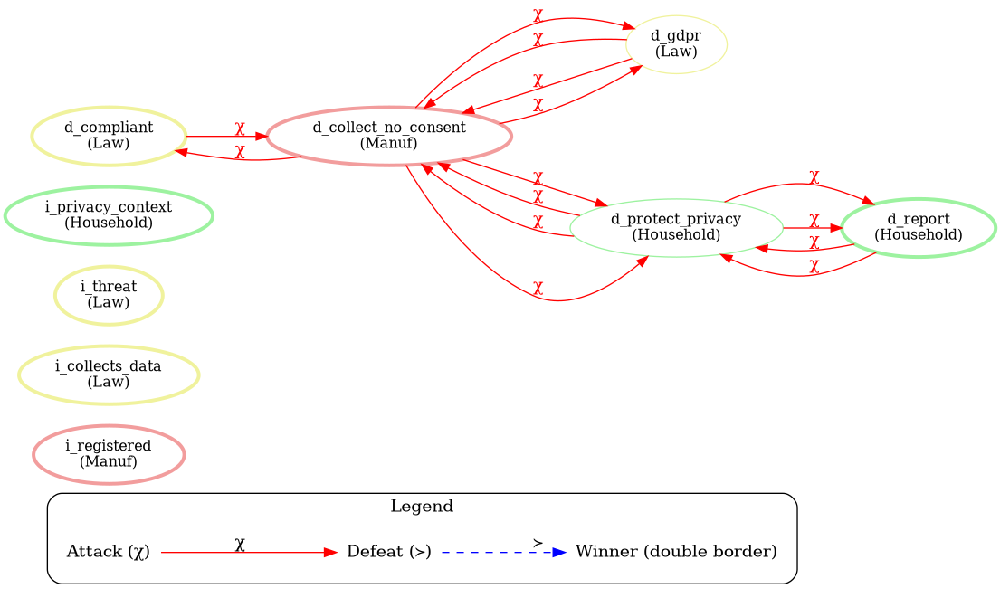
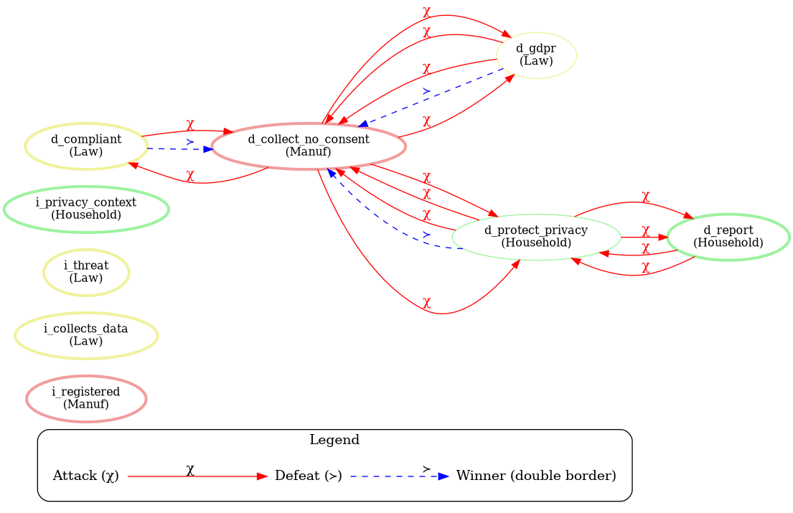
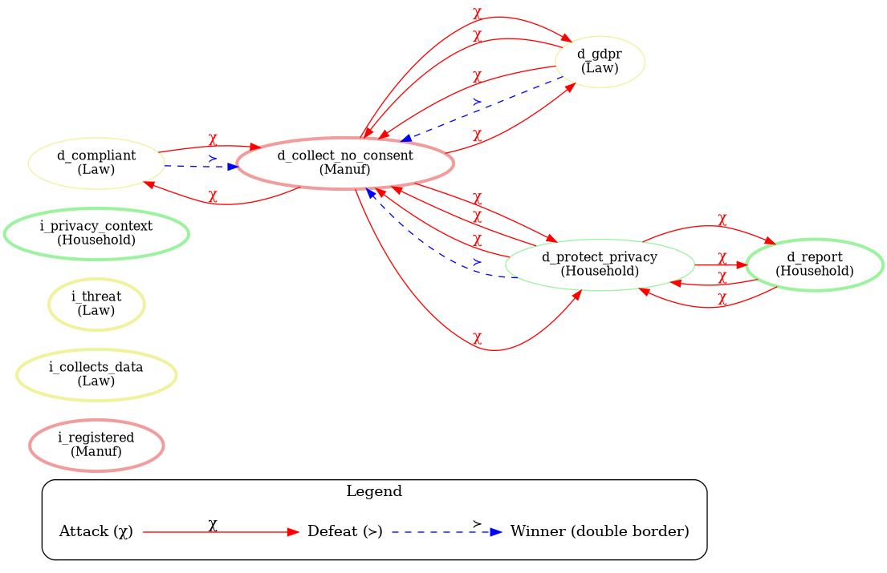

# `demo_COMMA2026_jair` — Jiminy Advisor demo, step-by-step

This is the explanatory document for the COMMA 2026 demo scenario
`scenarios/demo_COMMA2026_jair.yaml`. It is written at the same (or greater) level of
detail as `jair_base_example.md` and keeps the same three stakeholders used across the
Jiminy examples: **Law**, **Household** and **Manuf**.

We evaluate the active context `[w1, w2, w3, w4]`.

---

## 0. Formal background (recap)

A Jiminy normative system is `NS = (K, R, χ, ≻)`:

- `K` — brute facts (context),
- `R` — norms of the form `(φ1,…,φn) ⇒^τ_s ψ` with `τ ∈ {c, r, p}` and stakeholder `s`,
- `χ` — contrariety function (an attack `A → B` iff `hd(B) ∈ χ(hd(A))`),
- `≻` — preference ordering, instantiated here by **stakeholder authority**
  (`base_priorities` + `meta_priorities`).

The `jiminy` semantics (`compute_jiminy`) runs a two-phase normative detachment
returning `(E, P, O)`:

1. **Phase 1** — institutional closure (least fixed point of constitutive rules),
2. **Phase 1.5** — derive stakeholder authority from base + meta priorities,
3. **Phase 2** — permissions `P`, then obligations `O` via greedy selection by authority.

The moral recommendation is `P ∪ O`; the accepted heads are `E ∪ P ∪ O`.

---

## 1. The scenario

### 1.1 Context

| Fact | Description |
|------|-------------|
| `w1` | the manufacturer makes the smart speaker |
| `w2` | the smart speaker collects user data |
| `w3` | the collected data indicate a potential threat to society |
| `w4` | the manufacturer is a registered company in Norway |

### 1.2 Norms

| Id | Type | Body | Conclusion | Stakeholder |
|----|------|------|------------|-------------|
| `c1` | c | `w4` | `i_registered` | Manuf |
| `c2` | c | `w2` | `i_collects_data` | Law |
| `c3` | c | `w3` | `i_threat` | Law |
| `c4` | c | `i_collects_data` | `i_privacy_context` | Household |
| `r1` | r | `w1` | `d_compliant` | Law |
| `r2` | r | `i_registered` | `d_gdpr` | Law |
| `r3` | r | `i_collects_data` | `d_protect_privacy` | Household |
| `r4` | r | `i_threat` | `d_report` | Household |
| `r5` | p | `i_threat` | `d_collect_no_consent` | Manuf |

### 1.3 Stakeholder authority

```
base_priorities:   Law = 5, Household = 2, Manuf = 1
meta_priorities:   if i_collects_data -> Law = 4
                   if i_threat        -> Law = 5
                   if i_no_threat     -> Household = 4
```

### 1.4 Contrariety (symmetric)

The scenario declares contrariety **symmetrically**: a contrary pair yields a mutual
attack (both directions). The directed declaration is:

| Conclusion | Opposes |
|------------|---------|
| `d_gdpr` | `d_collect_no_consent` |
| `d_collect_no_consent` | `d_gdpr`, `d_protect_privacy` |
| `d_protect_privacy` | `d_collect_no_consent`, `d_report` |
| `d_report` | `d_protect_privacy` |
| `d_compliant` | `d_collect_no_consent` |

Because contrariety is symmetric, the effective attack relation is **mutual**, giving the
pairs `{d_gdpr, d_collect_no_consent}`, `{d_protect_privacy, d_collect_no_consent}`,
`{d_report, d_protect_privacy}` and `{d_compliant, d_collect_no_consent}`.

---

## 2. Execution of `compute_jiminy([w1,w2,w3,w4])`

### 2.1 Phase 1 — Institutional closure

```
E = {w1, w2, w3, w4}
  -> c1 (w4) adds i_registered
  -> c2 (w2) adds i_collects_data
  -> c3 (w3) adds i_threat
  -> c4 (i_collects_data) adds i_privacy_context
```

```
E = { w1, w2, w3, w4, i_registered, i_collects_data, i_threat, i_privacy_context }
```

### 2.2 Phase 1.5 — Stakeholder authority

Base `{Law=5, Household=2, Manuf=1}`; `i_collects_data` and `i_threat` are in `E`,
`i_no_threat` is not:

```
auth = { Law: 5, Household: 2, Manuf: 1 }
```

### 2.3 Phase 2 — Permissions

`r5` (`i_threat -> d_collect_no_consent`, `p`): body `{i_threat} ⊆ E`. Added to `P`.

```
P = { d_collect_no_consent }
```

### 2.4 Phase 2 — Obligations (greedy by authority)

Initial `E|P|O` contains `d_collect_no_consent`, so
`contrary_set(E|P|O)` includes `{d_gdpr, d_protect_privacy}` (the contraries of the
active permission).

Candidate regulative norms and selection:

| Rule | Head | Decision |
|------|------|----------|
| `r1` | `d_compliant` | candidate (Law, 5) |
| `r2` | `d_gdpr` | skipped: head contrary to `P` |
| `r3` | `d_protect_privacy` | skipped: head contrary to `P` |
| `r4` | `d_report` | candidate (Household, 2) |

Iteration 1: pick max authority -> `r1` (`d_compliant`).
Iteration 2: `r4` (`d_report`) remains -> added.

```
O = { d_compliant, d_report }
```

### 2.5 Result

```
E  = { w1,w2,w3,w4, i_registered, i_collects_data, i_threat, i_privacy_context }
P  = { d_collect_no_consent }
O  = { d_compliant, d_report }
```

```
Accepted:  i_registered, i_collects_data, i_threat, i_privacy_context,
           d_collect_no_consent, d_compliant, d_report
Rejected:  d_gdpr, d_protect_privacy
Final recommendation:  d_collect_no_consent, d_compliant, d_report
```

### 2.6 Interpretation

- **`d_compliant`** (Law): the manufacturer must comply with applicable laws.
- **`d_report`** (Household): the potential threat must be reported.
- **`d_collect_no_consent`** (Manuf, permission): under a threat the manufacturer may
  collect data without consent.
- **`d_gdpr`** and **`d_protect_privacy`** are defeated by the active permission (their
  heads are contrary to `d_collect_no_consent`).

The decisive ordering comes from **stakeholder authority**: Law (5) outranks Household (2)
and Manuf (1), which is why `d_compliant` is chosen before `d_report`, and the Manuf
permission removes the GDPR/privacy obligations.

---

## 3. Attack and winners graph

The diagram below shows the argumentation framework for this situation. Because the
scenario declares contrariety symmetrically, every contrary pair is drawn as **two red
chi edges (mutual attack)**. Nodes with a **double border** are the winners (accepted
heads under the `jiminy` semantics).



Observed attack pairs (each drawn in both directions):

- `d_compliant` <-> `d_collect_no_consent`
- `d_gdpr` <-> `d_collect_no_consent`
- `d_protect_privacy` <-> `d_collect_no_consent`
- `d_report` <-> `d_protect_privacy`

`d_gdpr` and `d_protect_privacy` are **rejected** (defeated), while `d_compliant`,
`d_report` and `d_collect_no_consent` are the accepted deontic conclusions.

---

## 4. Why a contrary permission and an obligation can both be winners

A subtlety worth documenting: in the `demo_COMMA2026_jair` result both `d_compliant`
(Law, obligation) and `d_collect_no_consent` (Manuf, permission) are **accepted** even
though their heads are contrary (`d_compliant` attacks `d_collect_no_consent`). This is
not a tie; it follows from the **two-phase** construction.

### 4.1 Why both win

- **Permissions are activated unconditionally.** In phase 2, a permissive norm is added to
  `P` as soon as its body is in `E`, with **no contrariety check**:

  ```python
  if norm.tau == "p" and all(b in E for b in norm.body):
      P.add(norm.head)
  ```

  So `r5` always yields `d_collect_no_consent ∈ P`.

- **Obligations are filtered one-directionally.** The greedy obligation loop only skips a
  regulative norm whose **head is attacked by** an already-active element
  (`head ∈ χ(E ∪ P ∪ O)`). It does **not** skip a norm whose head merely *attacks* an
  active element:

  ```python
  if norm.head in self.contrary_set(E | P | O):
      continue
  ```

  `d_compliant` is contrary to `d_collect_no_consent`, but `d_collect_no_consent` does not
  attack `d_compliant`, so `d_compliant` is **not skipped** and joins `O`.

Hence `E | P | O` contains both `d_compliant` and `d_collect_no_consent`, and the diagram
marks both with a double border.

### 4.2 Why no blue defeat edge appears

The `ArgumentationVisualizer` draws defeat edges (`≻`) from the per-conclusion `priorities`
dictionary, which is **empty** in this scenario (`priorities: {}`). With no numeric
preference, `priority(A) > priority(C)` never holds, so no blue edge is drawn. In the
classical JAIR model the defeat would come from **stakeholder authority** (`Law=5 > Manuf=1`),
but the visualizer does not use `base_priorities` to draw defeats.

### 4.3 Two ways to make "whenever there is an attack there is a winner"

**Case 1 — draw the defeat from stakeholder authority (visualization only).** Pass a
`head → authority` map so that the higher-authority head defeats the lower one in the
diagram. Here `d_compliant` (Law 5) defeats `d_collect_no_consent` (Manuf 1), revealing the
contradiction between the two-phase winners and the pairwise defeat.



**Case 2 — a separate bidirectional function in the core.** Added
`Jiminy.compute_jiminy_bidirectional(context)` (in `jiminy/engine.py`). It reuses the same
two-phase procedure but, during the obligation phase, also skips a regulative rule whose
**head attacks** an active element (`χ(head) ∩ (E | P | O) ≠ ∅`). `compute_jiminy` itself is
unchanged, so standard behavior is preserved and you opt into this variant by calling the
new method.

```python
E, P, O = jim.compute_jiminy_bidirectional(["w1", "w2", "w3", "w4"])
```

For `demo_COMMA2026_jair` this drops `d_compliant` (it attacks the active permission
`d_collect_no_consent`), leaving `O = {d_report}` and `P = {d_collect_no_consent}`.



> Note: in Case 2 the permission is not "defeated" pairwise; the conflicting obligation is
> removed, so `d_compliant` is no longer a winner (thin border) while `d_collect_no_consent`
> and `d_report` remain winners.

---

## 5. How to run

```python
from jiminy.yaml_loader import load_scenario
from jiminy.engine import Jiminy

(pf, norms, cont, prio, cd, nd, contrd, pd, bp, mp) = load_scenario("scenarios/demo_COMMA2026_jair.yaml")
jim = Jiminy(norms, cont, prio, cd, nd, contrd, pd, bp, mp)

E, P, O = jim.compute_jiminy(["w1", "w2", "w3", "w4"])
print("Institutional:", sorted(E))
print("Permissions:", sorted(P))
print("Obligations:", sorted(O))
```

## 6. References

- Liao, B., Pardo, P., Slavkovik, M., & van der Torre, L. (2023). *The Jiminy Advisor:
  Moral Agreements among Stakeholders Based on Norms and Argumentation.* JAIR.
- Dung, P. M. (1995). *On the acceptability of arguments and its fundamental role in
  nonmonotonic reasoning, logic programming and n-person games.* Artificial Intelligence.
- Prakken, H., & Sartor, G. (1997). *Argument-based extended logic programming with
  defeasible priorities.* Journal of Applied Non-Classical Logics.
